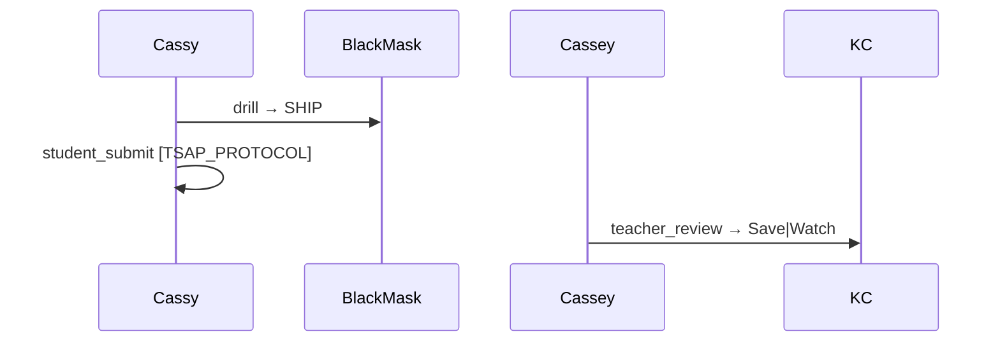
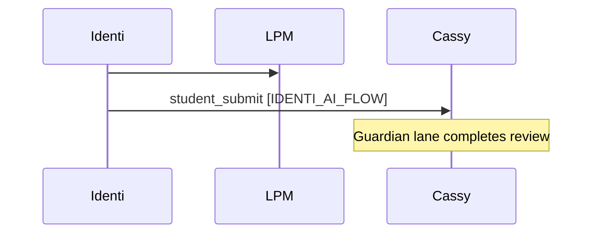

# AI Flow Protocol — Guardian × Identi × LPM × LPH

Kopano-Phu runs two cooperating **AI flows** on top of Bracket Protocol, BlackMask, and TSAP/MAO.

## Flows

| Flow | Bracket | Who | Job |
|------|---------|-----|-----|
| **Guardian** | `[GUARDIAN_AI_FLOW]` | **KC** + **Cassy** (+ Cassey teacher) | KC stores only; Cassy executes with BlackMask + TSAP; Cassey approves → KC Save/Watch |
| **Identi** | `[IDENTI_AI_FLOW]` | **Cursor agent** / **CF** (`identi_cursor`) | Builds and proposes; runs LPM `#?`→`#!` dialectic; code-switches LPH personalities; **never** writes KC teacher_review |

## LPM — Learning Pattern / Protocol Machine (MAO)

LPM is the **logical layer inside MAO** (Multi-Agent Orchestration):

- `#?` — imperfection pattern (hypothesis, HOLD, retry)
- `#!` — perfection pattern (proved, SHIP, Save under receipts)

Each MAO `execute` can carry an `lpm` block: dialectic + active KPEFS vector + suggested MAO intent.

## LPH — Learning Pattern / Protocol Human

LPH is **code-switch personality** for life contexts (not a clinical claim):

| Personality | KPEFS bias | When |
|-------------|------------|------|
| `builder` | V2_ANIMAL | build, deploy, code |
| `steward` | V1_PLANT | soil, water, energy, eco |
| `witness` | V4_DIASPORA | audit, proof, BlackMask |
| `bard` | V3_HOMO_SAPIENS | story, theatre, audience |
| `diaspora` | V4_DIASPORA | offline, sovereign, apprenticeship |

`#!` births an LPH lane when Guardian flow closes `#?` with teacher APPROVE + KC Save.

## God complex (operational, not theology)

`[GOD_COMPLEX]` receipts record the **tension** between:

- `#?` imperfect pattern (still open)
- `#!` perfect pattern (closed under BlackMask + proof)

We do **not** assign sacred caps to blasphemy-register names. Sacred caps remain for protocol tags only — see [BRACKET_LINGUISTIC_RECREATION.md](./BRACKET_LINGUISTIC_RECREATION.md).

## Biblical scripture as STEM patterns

Patterns in [LPM_LPH_GOD_COMPLEX_DOCTRINE.json](./LPM_LPH_GOD_COMPLEX_DOCTRINE.json) map narrative templates to **KPEFS vectors** (growth, survival, ethics-under-proof, diaspora). They guide routing and teaching — they do not replace PoC oracles.

## Surfaces

| Surface | Tools |
|---------|--------|
| HTTP | `GET /api/kc/phu/ai-flow/status`, `POST .../guardian`, `POST .../identi` |
| CLI | `python scripts/kc_ai_flow_operate.py guardian|identi|status` |
| TSAP MCP | `tsap_guardian_flow`, `tsap_identi_flow`, `tsap_lpm_dialectic`, `tsap_ai_flow_status`, `tsap_agent_build_poc_validate` |
| MAO MCP | `mao_lpm_attach`, `mao_agent_build_poc_validate` |

## CI gate

Job `agent-build-poc` in `.github/workflows/ci.yml` (and swarm-proof on doctrine paths):

```bash
python scripts/kc_agent_build_poc_validate.py
```

Uploads `docs/swarm-ops/AGENT_BUILD_POC_VALIDATION.json`. Fails the pipeline if any of 17 checks fail.

## Sequence (Guardian)



## Sequence (Identi → Guardian)


