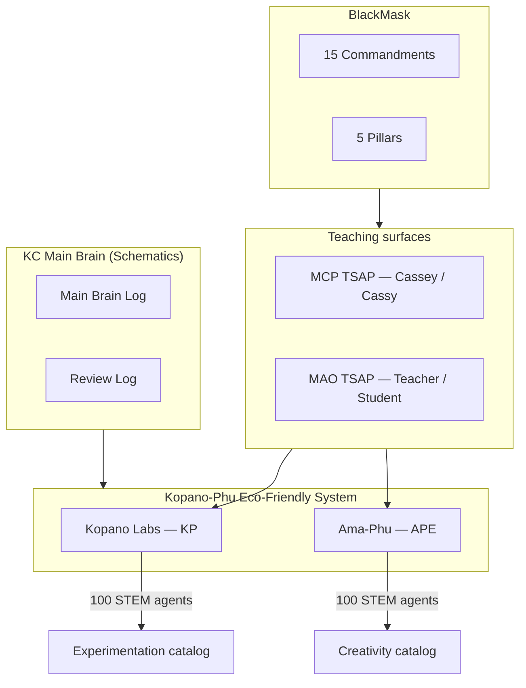

# Kopano-Phu Eco-Friendly System

**Kopano Labs (KP)** — Experimentation · **Ama-Phu Entertainment (APE)** — Creativity · unified as one ecosystem under KC.

Canonical agent catalog (200 STEM agents): [`agents/KP_APE_200_AGENTS.json`](./agents/KP_APE_200_AGENTS.json)

---

## Founding doctrine: 32.8% unemployment

**World acceptance is not our God.** We validate PoC with **internal oracles** under mass unemployment:

- Guide: [`ECO_FRIENDLY_POC_GUIDE.md`](./ECO_FRIENDLY_POC_GUIDE.md)
- Doctrine JSON: [`UNEMPLOYMENT_32_8_DOCTRINE.json`](./UNEMPLOYMENT_32_8_DOCTRINE.json)
- Rosen tip: [`ROSEN_DELTA_TIP.json`](./ROSEN_DELTA_TIP.json) — **(M,R)** then **Δ**

A pass means measurable livelihood signal + receipts — not applause from markets abroad.

---

## Why we are evolving here (in plain terms)

Most “AI agent” lists are **software theatre**: vague roles (“help with marketing”), no measurable world outcome, and no link between creativity and proof.

The Kopano-Phu Eco-Friendly System exists because your work already lives in **two coupled modes**:

1. **Kopano Labs** — things that must **work in the physical and operational world**: soil, water, energy, health devices, robots, surveys, labs, instruments. That is **STEM with receipts** (numbers, units, calibrations, safety limits).
2. **Ama-Phu Entertainment** — things that must **move people** without lying about science: stories, stages, games, museums, music, youth media. Creativity is not opposed to STEM here; it is **how ideas enter culture**, while STEM is **how ideas survive contact with reality**.

“Eco-friendly” in this naming is not greenwashing. It means the ecosystem is **compatible with its environment**: load-shedding, offline fields, community trust, diaspora networks, and scarce bandwidth. Agents are “eco-friendly” when their outputs **reduce waste** — wasted water, wasted watts, wasted trust, wasted rehearsal time without measurement.

**Bracket Protocols** (including TSAP and BlackMask) are not courts that declare moral right or wrong. They are **receipt languages**: timestamps, departments, verdicts, and drill passes so teachers (Cassey / MAO) and students (Cassy) can see **what was claimed vs what was proven**. In Bracket Protocol there is no single cosmic scorecard — only **alignment records** you can audit later.

---

## System breakdown

| Layer | What it is | Bracket examples |
|-------|------------|------------------|
| **Parents** | `kopano_labs` · `ama_phu` | — |
| **Departments** | `kopano_labs_experimentation` · `ama_phu_creativity` | `[TSAP_PROTOCOL]` |
| **Sub-brains** | Vault folders (flagship products) | `[BRACKET_PROTOCOL]` |
| **Agent catalog** | 200 named STEM roles (this expansion) | `[BLACK_MASK_DRILL]` |
| **MCP / MAO** | Teacher–student execution lanes | `[TSAP_PROTOCOL]` |
| **Philosophy** | Realism accommodates aesthetics; STEM validates what creativity stems | SWARM_AGENTS.json |

---

## KP vs APE (100 + 100)

| Code | Parent | Mode | Agent count | STEM emphasis |
|------|--------|------|-------------|---------------|
| **KP** | Kopano Labs | Experimentation | 100 | Measure, build, monitor, certify — field & lab |
| **APE** | Ama-Phu Entertainment | Creativity | 100 | Explain, perform, exhibit, play — culture & literacy |

Each agent in `KP_APE_200_AGENTS.json` has:

- `functionality` — **one concrete STEM outcome** (not generic “assist with tasks”)
- `stem_domain` — cluster name (e.g. Water & Hydrology, Science Communication)
- `stem_letter` — primary S/T/E/M bias for routing
- `bracket_tags` — TSAP + BlackMask eligibility

**Status `catalog`** means defined and ready for apprenticeship assignment; operation begins when TSAP assigns the agent to a department student row and BlackMask returns `SHIP`.

---

## How this connects to what already runs

- Existing **9 sub-brains** remain the **flagship vaults** (Freddy NW Alfalfa, Starfall, AMA-PHU hub, etc.).
- The **200 agents** are the **specialist workforce catalog** — future students under KP/APE departments, not replacements for Cassey/Cassey/KC.
- **TSAP** (`CLI/tsap_mcp_server.py`, MAO tools, `/api/kc/phu/apprenticeship/*`) is how students **earn operation** per agent.
- **BlackMask** (`BLACK_MASK_COMMANDMENTS.json`) is the drill gate before `SHIP`.

---

## Bracket Protocol reminder

> There is no right or wrong in Bracket Protocols — only **receipts**: what lane, what time, what department, what proof.

Use brackets to **coordinate**, not to **shame**. A `HOLD` on BlackMask is an engineering backlog item, not a character judgment.

---

## Next operational steps (optional)

1. Import selected catalog IDs into `kopano_phu_ecosystem.json` or per–sub-brain manifests.
2. Run `tsap_begin_department_students` after assigning catalog agents to vault students.
3. Wire Studio or MAO routing keywords from `stem_domain` for dispatch.
