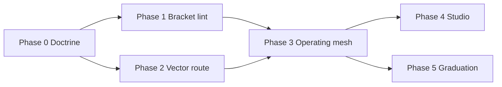

# KPEFS Implementation Plan — Kopano-Phu Eco-Friendly System → Reality

**KPEFS** = Kopano Labs (KP) + Ama-Phu Entertainment (APE) under one eco-compatible stack.

**Four vectors** (priority for design, not moral ranking of life):

| Rank | Vector | Metaphor | System job |
|------|--------|----------|------------|
| 1 | `V1_PLANT` | Growing only | Soil, water, energy, green metrics — KP experimentation |
| 2 | `V2_ANIMAL` | Growth + survival | Health, robotics, materials, field survival — KP |
| 3 | `V3_HOMO_SAPIENS` | Culture + ethics | APE creativity with STEM proof — realism accommodates aesthetics |
| 4 | `V4_DIASPORA` | **Very important** | Cassy apprenticeship, offline sovereignty, 32.8% livelihood — crosses KP+APE |

**Blasphemy register:** concepts like `oNE_wORLD_oRDER`, `elon_mask`, `je`, `silcon_valley` — **no honorific caps** in brackets. See [BRACKET_LINGUISTIC_RECREATION.md](./BRACKET_LINGUISTIC_RECREATION.md).

**Already shipped (foundation):**

- BOOT v1 governance — `Structure/07-Agents/`
- TSAP + BlackMask — `phu_apprenticeship.py`
- 200 STEM agents — `KP_APE_200_AGENTS.json`
- PoC oracles — `eco_poc_validate.py`
- 32.8% doctrine — `UNEMPLOYMENT_32_8_DOCTRINE.json`

---

## Phase 0 — Doctrine lock (now)

| Deliverable | Path | Done |
|-------------|------|------|
| Four-vector doctrine | `KPEFS_FOUR_VECTOR_DOCTRINE.json` | yes |
| Bracket linguistics | `BRACKET_LINGUISTIC_RECREATION.md` | yes |
| Blasphemy register | `BRACKET_BLASPHEMY_REGISTER.json` | yes |
| This plan | `KPEFS_IMPLEMENTATION_PLAN.md` | yes |

**Exit:** Main Brain row `kind: kpefs_plan_locked` with `[KPEFS_FOUR_VECTOR]` receipt — append via `kc_log_append.py mainbrain --bracket-lint`.

---

## Phase 1 — Bracket linter (week 1)

| Task | Output |
|------|--------|
| `scripts/kc_bracket_lint.py` | Fail on sacred caps for blasphemy register | yes |
| Hook `kc_log_append.py` | Optional `--bracket-lint` on summary | yes |
| Hook `student_submit` / Main Brain append | Reject polluted bracket tags | yes (student_submit) |

**Exit:** `python scripts/kc_bracket_lint.py --check-logs` exit 0 on last 50 rows.

---

## Phase 2 — Vector routing (week 1–2)

| Task | Output |
|------|--------|
| `kopano-core/kopano/kpefs_router.py` | Map message → V1..V4 + KP/APE department | yes |
| Extend `mao_dispatch.py` | Prepend vector tag to route metadata | yes |
| Tag `KP_APE_200_AGENTS.json` | Add `kpefs_vector` field per agent (`tag_kp_ape_kpefs_vector.py`) | yes |

**Exit:** `mao_route` returns `vector: V4_DIASPORA` for “diaspora apprenticeship offline”.

---

## Phase 3 — Operating mesh (week 2–3)

| Task | Output | Done |
|------|--------|------|
| Assign catalog agents → sub-brains | Only with PROOF-01..03 from `PROMOTION_LAW.json` | yes — `operating_mesh.py` `FLAGSHIP_ASSIGNMENTS` |
| Live BlackMask (not dry) | `blackmask_drill` per flagship | yes |
| Eco PoC per flagship | One PASS receipt per sub-brain | yes — `validate_eco_poc` per catalog agent |
| CLI | `scripts/kc_phu_operating_mesh.py` | yes |
| API | `GET /operating-mesh/status`, `POST promote-all` | yes |

**Exit:** 9 sub-brains + 1 APE hub have `operating` + PoC PASS — run `python scripts/kc_phu_operating_mesh.py promote-all`.

---

## Phase 4 — Studio KPEFS console (week 3–4)

| Task | Output | Done |
|------|--------|------|
| API `GET /api/kc/phu/kpefs/status` | Vectors + boot + operating mesh | yes |
| API `POST /api/kc/phu/bracket-lint` | Lint on submit text | yes |
| Studio tab | `KpefsConsolePanel` — Console mode `kpefs` | yes |

**Exit:** Operator sees four vectors and bracket lint blocks polluted tags before route; blasphemy helper text shown.

---

## Phase 5 — Graduation bar (separate track)

| Task | Output | Done |
|------|--------|------|
| Do not conflate with BOOT or drill | `graduation_bar.py` + `kc_guard.py --require-verified-production` | yes |
| Operating ≠ graduated | `graduation_claim_allowed()` rejects conflated claims | yes |
| Kimi / external swarm | CMD-03 status in `external_swarm_receipt_status()` | yes |
| CLI | `scripts/kc_phu_graduation_bar.py` | yes |
| API | `GET /graduation-bar/status`, steward-trust, check-claim | yes |
| PoC gate | `agent_build_poc_validate` checks mesh + graduation | yes |

**Exit:** `verified_production >= public_graduation_bar` for public graduated — run `python scripts/kc_phu_graduation_bar.py status`.

---

## Dependency graph



---

## What we do not build

- No fifth “vector” for blasphemy entities — they stay in **register only**, not agents.
- No capital letters for `oNE_wORLD_oRDER` in any bracket receipt.
- No promotion from narrative, VC applause, or `silcon_valley` aesthetics alone.
- No duplicate student roles — `cassy` only (BOOT v1).

---

## Commands (operator)

```powershell
python scripts/kc_phu_boot_v1.py apply
python scripts/kc_bracket_lint.py --self-test
python scripts/kc_phu_boot_v1.py blackmask-dry-run
python scripts/kc_eco_poc_validate.py --guide
python scripts/kc_phu_operating_mesh.py status
python scripts/kc_phu_graduation_bar.py status
python scripts/kc_agent_build_poc_validate.py
python scripts/kc_kpefs_full_gate.py
python scripts/kc_kpefs_full_gate.py --append-main-brain
python scripts/kc_kpefs_run_snapshot.py --append-main-brain
```

When you return from a run: `python scripts/kc_kpefs_run_snapshot.py` — refreshes `docs/swarm-ops/KPEFS_CLOSURE_STATUS.json`.

## MCP (TSAP / MAO)

| Tool | Purpose |
|------|---------|
| `tsap_kpefs_status` / `mao_kpefs_status` | Vectors + mesh + graduation |
| `tsap_kpefs_route` | Message → V1..V4 |
| `tsap_bracket_lint` | Lint before submit |
| `tsap_operating_mesh_status` | Phase 3 flagships |
| `tsap_graduation_bar_status` | Phase 5 bar |
| `tsap_kpefs_full_gate` / `mao_kpefs_full_gate` | One-shot 0-5 gate |
| `tsap_external_swarm_status` | CMD-03 receipt + guide |
| `tsap_kpefs_closure_status` | Internal complete vs external pending |

## CMD-03 — External swarm (human lane)

| Task | Output |
|------|--------|
| Status + guide | `scripts/kc_external_swarm_lane.py status\|closure\|validate-url` |
| API | `GET /external-swarm/status`, `GET /closure/status` |
| Rule | Never fabricate `kimi_ack` — log only after real external artifact |

```powershell
python scripts/kc_external_swarm_lane.py closure
python scripts/kc_external_swarm_lane.py validate-url --url "https://<artifact>"
python scripts/kc_log_append.py kimi-ack --payload-ref docs/swarm-ops/PAYLOAD_KIMI_300_ACTIVATION.md --status acknowledged --evidence-url "https://<artifact>" --strict-proof
```

KPEFS Phases 0–5 implemented. **CMD-03 external swarm** is a separate human lane — see `external_swarm_lane.py` and `python scripts/kc_external_swarm_lane.py closure`.

Maintain via `python scripts/kc_kpefs_full_gate.py` + `kc_guard.py all --require-verified-production 10`.

## CI — agent build PoC gate

| Workflow | Job | Command |
|----------|-----|---------|
| `.github/workflows/ci.yml` | `agent-build-poc` | `python scripts/kc_agent_build_poc_validate.py` |
| `.github/workflows/swarm-proof.yml` | (swarm paths) | same + pytest `tests/test_agent_build_poc_validate.py` |

Report artifact: `docs/swarm-ops/AGENT_BUILD_POC_VALIDATION.json` (uploaded on CI failure/success).
