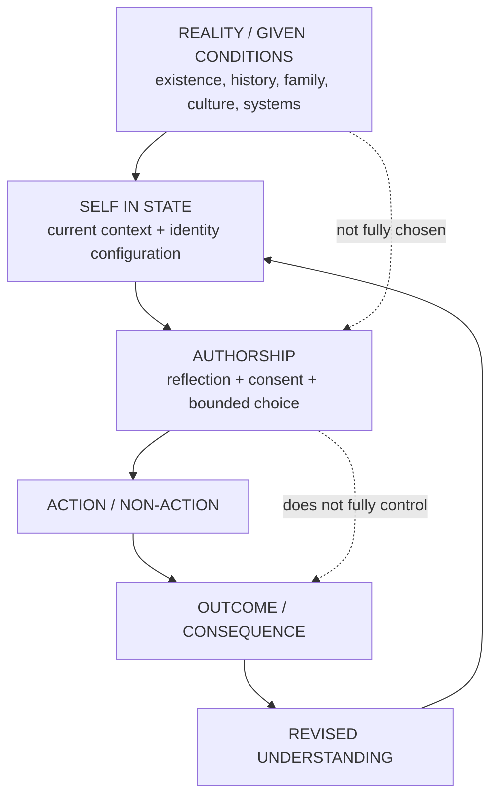
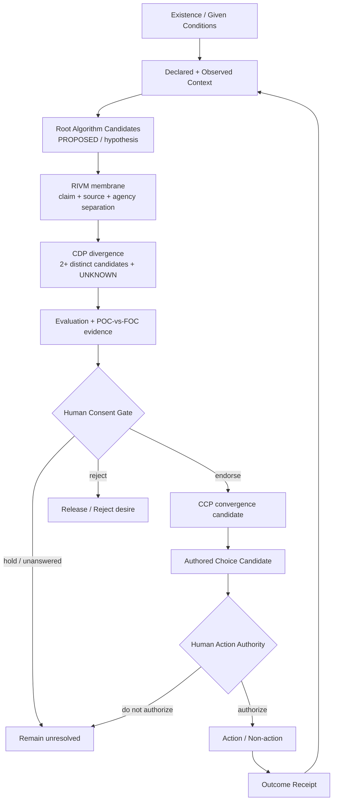

# KPGS Human Choice Authorship Membrane — POC

Status: **PROPOSED / POC**  
Issue: #49  
Parent epic: #46

## Thesis

Human choice can be modelled as **authorship inside conditions that were not chosen**.

This POC does not claim total human control and does not collapse the human into deterministic conditioning. It models a narrower jurisdiction: inherited conditions and default sequences may shape desire, but conscious reflection can expose those influences and create a human-controlled consent boundary before action.

The core question is:

> **Now that I can see what shaped this desire, do I still consent to carrying it?**

The answer belongs to the human. No AI, protocol, model, memory layer, agent, renter, evaluator or canonicalization mechanism may manufacture that consent.

## Source lineage and authority

This POC references Project Jennifer at commit `5328a8449bad509150f73fe9aafeabc6c17c983b`.

Authoritative protocol references at that revision:

- `docs/architecture/adr-0006-rivm-cdp-ccp-relational-orchestration.md`
- `docs/architecture/adr-0005-governed-source-authority-and-rivm.md`
- `skills/forge-rivm/SKILL.md`
- `skills/cdp-conceptual-divergence/SKILL.md`
- `skills/ccp-conceptual-convergence/SKILL.md`
- `packages/conceptual/src/rivm/RelationalConceptualOrchestrator.ts`
- `packages/conceptual/src/cdp/ConceptualDivergenceRuntime.ts`

Project Jennifer remains authoritative for the meaning of RIVM, CDP and CCP. This KPGS POC composes those boundaries for a new use case; it does not silently redefine them.

## What is validated from Project Jennifer

RIVM is an inference-validation membrane for consequential relationship-bearing interactions. It separates claim classes, preserves human agency, prevents source collapse and is explicitly **not** the sovereign source.

CDP answers **“What could this become?”** It widens a governed possibility field. Its runtime requires at least two structurally distinguishable candidates, preserves an unknown possibility by default and emits hypotheses with `canonical: false`.

CCP answers **“What consistently works / survives the evidence?”** It narrows after divergence and evaluation. Only its `Accepted` state is canonical in the current Project Jennifer implementation.

Therefore the correct composition for human-choice exploration is not “RIVM decides the choice.” RIVM guards the truth/agency/source membrane around the interaction; CDP generates alternative explanations or futures; evidence/evaluation tests them; the human independently supplies or withholds consent; CCP may govern conceptual convergence, but CCP still does not possess authority to make the human's life decision.

## Proposed concept: root algorithm

A **root algorithm** is a proposed descriptive model for an inherited or socially defaulted sequence that can shape expectations and behaviour before the individual consciously authors it.

Example shape:

```text
primary school
    -> high school
    -> university
    -> employment
    -> stability
    -> retirement
```

A root algorithm is **not** automatically a fact, destiny, diagnosis, causal proof, or universal law. It begins as a hypothesis whose source, context, evidence and contradictions must remain visible.

The important failure mode is **sequence/reality collapse**: treating one inherited route as reality itself rather than one available route through reality.

## Triangle model



The triangle rejects both extremes:

```text
TOTAL CONTROL       TOTAL SURRENDER
“I determine all”   “I determine nothing”
        \             /
         \           /
          BOUNDED AUTHORSHIP
        choice inside conditions
          not fully chosen
```

## Governed flow



## State-of-mind rule

A state of mind may change attention, salience, interpretation, inhibition or association. The record may preserve a human-declared state label such as `sober`, `high`, `tired`, `afraid`, `peaceful`, `ambitious` or another free-text description.

The protocol does **not** treat a state as a separate person and does not declare one state the “true self.” State-tagged observations remain testimony/context unless separately evidenced. An altered-state insight may enter CDP as a candidate signal, but salience is not proof.

## Human authority law

The human can always:

- reject a root-algorithm interpretation;
- refuse convergence;
- leave the consent gate unanswered;
- endorse a desire while declining action;
- change an earlier endorsement without rewriting the historical receipt;
- request a new divergence cycle when the available alternatives are inadequate.

No protocol may infer `endorse` from affection, repetition, confidence, intoxication, silence, compliance, historical preference, or a model's prediction.

## Protocol responsibilities

```text
RIVM  -> Is the inference truthful, source-separated, warm and agency-preserving?
CDP   -> What structurally different explanations / futures could this become?
CEEP  -> How do the candidates evaluate?
POC/FOC -> What evidence actually exists versus what merely appears coherent?
HUMAN CONSENT -> Do I still consent to carrying this desire?
CCP   -> What conceptual pattern survives the evidence strongly enough to converge?
HUMAN AUTHORITY -> Do I actually act, refuse, defer or revise?
```

## Hard failures

This POC fails governance if it:

- converts a root-algorithm hypothesis into fact without evidence;
- produces only one explanation and calls it divergence;
- suppresses the unknown branch to force completeness;
- lets historical context override current human instruction;
- infers human consent instead of receiving it explicitly;
- equates CCP conceptual acceptance with authority to execute a life decision;
- assigns a hidden identity, diagnosis, motive or “true self” to the person;
- treats intoxicated or emotionally intense testimony as automatically more truthful;
- rewrites prior choices or contradictions to preserve a clean narrative;
- claims RIVM/CDP/CCP execution without a corresponding runtime receipt.

## Validation status

**Source-semantics validation: PASS.** The composition is grounded against the cited Project Jennifer protocol sources.

**Conceptual compatibility: POC PASS.** The model preserves RIVM agency/source laws, CDP non-canonical divergence and CCP convergence authority while keeping personal consent external to all three protocols.

**Empirical psychological claim: NOT CLAIMED.** `root algorithm` and this human-choice model are engineering/conceptual constructs, not established psychological diagnoses or universal scientific laws.

**Runtime/CI validation: BLOCKED.** GitHub Actions execution for `Introduction-to-MCP` is currently blocked under #48 by the account billing lock. Static contracts may be reviewed and validated, but CI must remain unverified until a runner actually executes the gate.